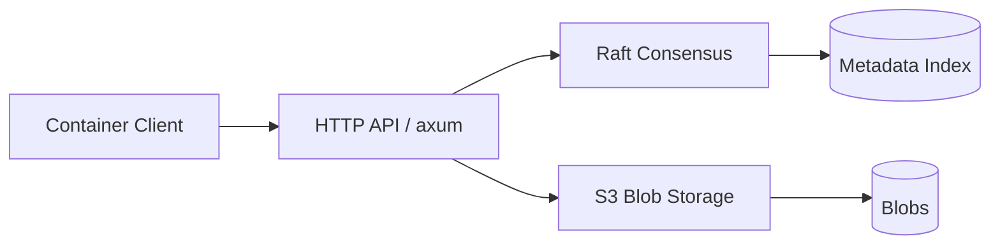

<p align="center">
  <picture>
    <source media="(prefers-color-scheme: dark)" srcset="docs/assets/brand/orb-chrysa-lockup-dark.svg">
    <source media="(prefers-color-scheme: light)" srcset="docs/assets/brand/orb-chrysa-lockup-light.svg">
    
  </picture>
</p>

Rust OCI container registry with built-in Raft clustering and S3 blob storage.
Single binary, no external dependencies (no PostgreSQL, Redis, etcd).

## Quick Start

```bash
# Start a 3-node cluster with local S3 (RustFS)
docker compose -f deploy/compose/cluster.yml up -d

# Push an image
docker tag alpine:latest localhost:5050/my-app/alpine:v1
docker push localhost:5050/my-app/alpine:v1

# Pull it back
docker pull localhost:5050/my-app/alpine:v1

# Browse the dashboard
open http://localhost:5050
```

## Features

- **OCI Distribution Spec** — full Docker/ORAS push/pull, manifests, tags, referrers
- **Raft clustering** — 3+ node HA with DNS-based peer discovery and S3 snapshot recovery
- **S3 blob storage** — content-addressable blob store, proxy and redirect modes
- **Embedded dashboard** — SolidJS SPA with repository browser, manifest viewer, cluster status
- **Mirror & proxy cache** — pull-through proxy cache, scheduled mirror jobs, push mirroring
- **Authentication via kanidm** — OIDC dashboard login, personal access tokens, CI service accounts
- **Helm chart support** — OCI-based Helm chart storage and browsing
- **Garbage collection** — reference-count based cleanup with configurable grace period

## Architecture



The key architectural insight: **metadata lives in the Raft state machine, blobs live in S3**.
Raft owns the index (tags, manifests, ref counts), S3 owns the bytes (layers, configs).

## Documentation

Full documentation at [adamcavendish.github.io/orb-chrysa](https://adamcavendish.github.io/orb-chrysa/).

- [Configuration Reference](https://adamcavendish.github.io/orb-chrysa/reference/config-reference.html)
- [Authentication Setup](https://adamcavendish.github.io/orb-chrysa/authentication.html)
- [Clustering Guide](https://adamcavendish.github.io/orb-chrysa/clustering.html)
- [Test Plans](docs/test-plans/)

## Building

```bash
cargo build --workspace --release
```

## Testing

```bash
# CI gate (fmt, clippy, unit tests, dashboard build)
just check

# End-to-end OCI workflow tests (requires running cluster)
just production-smoke

# Auth workflow tests (requires auth cluster with kanidm)
just auth-smoke
```

## Deployment

### Docker Compose

Three compose files for different deployment modes:

| File | Mode | Replicas | Auth |
|------|------|----------|------|
| `deploy/compose/standalone.yml` | Single node | 1 | No |
| `deploy/compose/cluster.yml` | Multi-node cluster | 3 | No |
| `deploy/compose/auth-cluster.yml` | Multi-node with kanidm | 3 | Yes |

```bash
# Non-auth cluster
just compose-up

# Auth-enabled cluster with kanidm
just compose-auth-up
```

### Kubernetes

The canonical production deploy artifact is `deploy/kubernetes/helm`. It installs a
three-pod StatefulSet by default, uses public registry/API port `5050`, uses
internal Raft port `5051`, and enables Raft mTLS for clustered installs.
Create the S3 credentials Secret and either provide the TLS Secrets generated by
`orb-chrysa-cli air-gapped ...` or enable cert-manager before installing.

```bash
helm upgrade --install orb-chrysa ./deploy/kubernetes/helm \
  --namespace orb-chrysa \
  --create-namespace \
  --set storage.s3.endpoint=https://s3.example.internal \
  --set storage.s3.bucket=orb-chrysa \
  --set storage.s3.existingSecret=orb-chrysa-s3
```

Pods must be named `<prefix>-<N>` (for example `orb-chrysa-0`). Node identity is
derived from the hostname suffix. All pods share identical configuration and
discover peers through the headless service.

For internal or air-gapped clusters, use `orb-chrysa-cli air-gapped ...` to
generate an internal CA, native HTTPS registry certs, Raft mTLS certs, Kubernetes
Secret YAML, Helm values, and containerd trust snippets. Kubernetes nodes must
trust the registry CA in their container runtime before workloads can pull images
from Orb Chrysa.

## License

Licensed under either of [Apache License, Version 2.0](LICENSE-APACHE) or
[MIT license](LICENSE-MIT) at your option.
