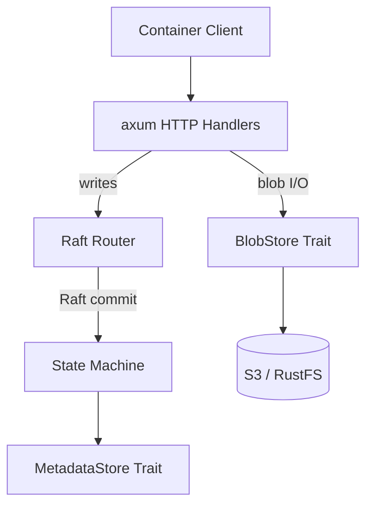

# Architecture

orb-chrysa is organized around a single architectural insight: **metadata lives in
the Raft state machine, blobs live in S3**. Raft owns the index (tags, manifests,
ref counts), S3 owns the bytes (layers, configs).

## Data Flow



## Crates

Two crates, modules not crates:

| Crate | Purpose |
|-------|---------|
| `orb-chrysa-server` | Registry server — HTTP API, Raft, storage, auth, dashboard |
| `orb-chrysa-cli` | CLI tool for registry operations and upstream auth |

All server logic is modules inside `orb-chrysa-server`:
- `routes/` — axum HTTP handlers (OCI Distribution Spec, admin API, dashboard API)
- `raft/` — OpenRaft integration (state machine, log store, network, membership)
- `store/` — Storage traits (MetadataStore, BlobStore) and S3 implementation
- `auth/` — Authentication and authorization (JWKS, JWT validation, permissions)
- `mirror/` — Mirror and proxy-cache (upstream client, scheduler)
- `gc/` — Garbage collection (reference-count based)

## Trait Boundary

The critical abstraction in orb-chrysa is the trait boundary between metadata and
blob storage:

- **`MetadataStore`** — Raft-backed. Manifests, tags, repos, referrers, ref counts,
  mirror rules, proxy caches, warm images, sync jobs, helm charts, PATs. All metadata
  operations go through Raft consensus.
- **`BlobStore`** — S3-backed. Blob stat/get/upload/delete. Pure S3 I/O, no Raft
  involvement.

`mount_blob` is on `MetadataStore` (not `BlobStore`) because the flat S3 namespace
means blob mounts are metadata-only operations.

## S3 Key Layout

```
blobs/sha256/<first-2-chars>/<full-digest>     # content-addressable blobs
uploads/<session-uuid>/data                     # in-progress uploads
raft-snapshots/<node-id>/latest.bin             # Raft state machine backups
```

## Error Model

Single `RegistryError` enum with three categories:

- **OCI spec errors** → 400/404 (14 OCI error codes)
- **Storage errors** → 500
- **Consensus errors** → 503 with Retry-After, or 307 redirect to leader
