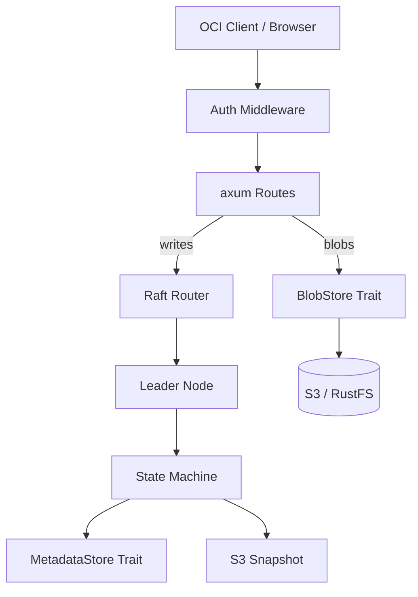

# Data Flow

## Request Path

## Write Path

1. Client sends PUT/POST/DELETE to `/v2/*` or `/api/*`
2. Auth middleware validates the bearer token
3. Route handler calls `MetadataStore` trait methods (e.g., `put_manifest`)
4. `RaftRouter` sends the command to the Raft leader
5. Leader commits the command to the Raft log
6. State machine applies the command to in-memory `BTreeMap` data structures
7. After a configurable number of log entries, a snapshot is built and uploaded to S3

## Read Path

1. Client sends GET/HEAD to `/v2/*` or `/api/*`
2. Auth middleware validates the bearer token
3. Route handler calls `MetadataStore` trait methods (e.g., `get_manifest`)
4. `RaftRouter` reads directly from the local `Arc<RwLock<StateMachineData>>`
5. No Raft consensus is involved — all nodes serve reads from their replicated copy

## Blob I/O

Blob operations bypass Raft entirely:

1. Client pushes a blob → `POST /v2/<name>/blobs/uploads/`
2. Upload tracker manages session state
3. Blob bytes are streamed directly to S3 via the `BlobStore` trait
4. On manifest push, blob existence is verified via parallel S3 HEAD checks
5. Blob reference counts are tracked in Raft (updated on manifest push/delete)
