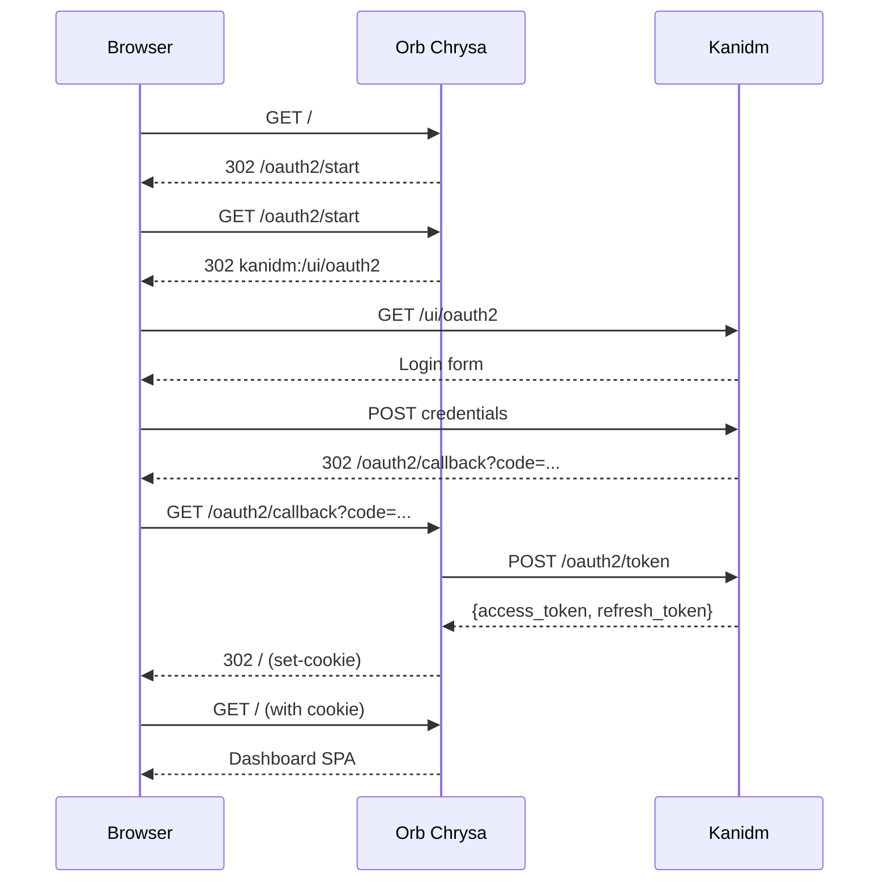

# Dashboard OIDC

The Orb Chrysa dashboard supports browser-based login via OpenID Connect through
kanidm.

## Flow



## Configuration

The dashboard OIDC flow requires these config values:

```toml
[auth]
issuer_url = "https://registry.example.com/oauth2/openid/orb-chrysa"
issuer_internal_url = "https://kanidm:8443/oauth2/openid/orb-chrysa"
client_id = "orb-chrysa"
client_secret = "<oauth2-client-secret>"
token_endpoint_url = "http://localhost:5050/v2/token"
redirect_uri = "http://localhost:5050/oauth2/callback"
token_signing_keys = ["<base64-encoded-key>"]
session_encryption_key = "<base64-encoded-32-byte-key>"
```

## Session Management

After successful login, Orb Chrysa sets an encrypted session cookie:

- **Name**: `orb_chrysa_session`
- **Encryption**: AES-256-GCM
- **Attributes**: `HttpOnly`, `SameSite=Lax`, `Path=/`
- **Lifetime**: Matches kanidm access token expiry

The session cookie is required for dashboard API access and PAT management.

## Endpoints

| Endpoint | Purpose |
|----------|---------|
| `GET /oauth2/start` | Initiate OIDC flow, redirect to kanidm |
| `GET /oauth2/callback` | Handle kanidm callback, exchange code for tokens |
| `GET /api/v1/session` | Get current session info (requires cookie) |
