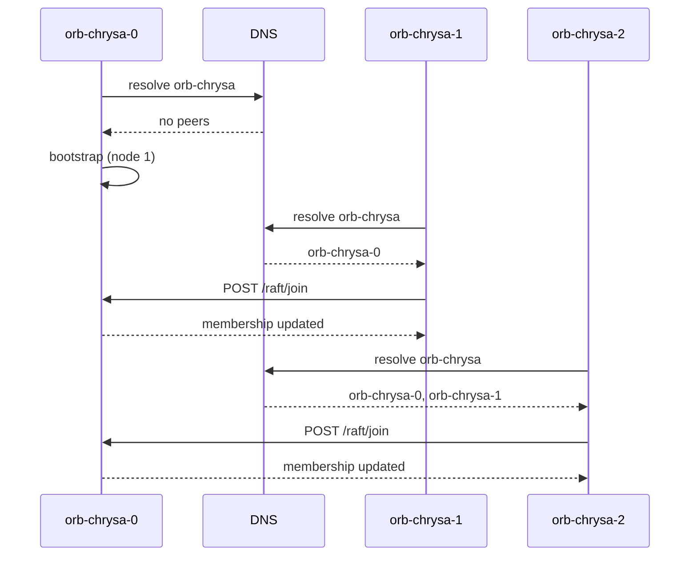

# Clustering

orb-chrysa uses [OpenRaft](https://github.com/datafuselabs/openraft) for distributed
consensus. Raft owns all metadata — manifests, tags, mirror rules, PATs — while blob
bytes are stored independently in S3.

## Cluster Model

- **No static peer list.** Peers are discovered via DNS lookup of the configured
  `discovery_dns` name. In Docker Compose, this is a network alias. In Kubernetes,
  this is the headless service name.
- **Node ID from hostname.** Container hostname must be `<prefix>-<N>`. Node ID is
  `N + 1` (so `orb-chrysa-0` becomes node 1).
- **All nodes share identical config.** No per-node configuration needed.
- **Ordinal 0 bootstraps.** If no cluster exists, the node with ordinal 0 (node_id=1)
  self-bootstraps. Subsequent nodes join via DNS discovery.
- **Dynamic membership.** Nodes can join and leave at runtime. The cluster
  automatically reconfigures.

## DNS Discovery

When a node starts, it resolves the `discovery_dns` name and attempts to join an
existing cluster. If no cluster exists (no reachable nodes) and this node has
ordinal 0, it bootstraps a new single-node cluster.

## Ephemeral Raft Log

The Raft log uses [redb](https://github.com/cberner/redb) — an embedded key-value
store. It is **ephemeral**: lost on pod restart. State is restored from S3 snapshots.

- `Compact()` is called after every snapshot build to reclaim log space
- No PersistentVolumeClaim needed for the log
- Cold-start nodes download the latest snapshot from S3

## Snapshot & Recovery

See [Snapshot & Recovery](clustering/snapshots.md) for details on the S3-based
snapshot mechanism.

## Graceful Shutdown

On SIGTERM:
1. Upload current state to S3 as a snapshot
2. Leave the Raft cluster
3. Exit

This ensures clean handoff and fast recovery for the replacement pod.

## Hostname Convention

Containers **must** be named `<prefix>-<N>`:
- Docker Compose: `hostname: orb-chrysa-0`
- Kubernetes: StatefulSet pod names (`orb-chrysa-0`, `orb-chrysa-1`)
- `docker-compose` `deploy.replicas` is **not supported** (no stable hostname)

## Read/Write Routing

- **Writes** go to the leader. If a follower receives a write, it is forwarded to
  the leader via HTTP redirect (307) or proxied.
- **Reads** use the local Raft state machine. All nodes serve reads from their
  replicated copy of the state.
